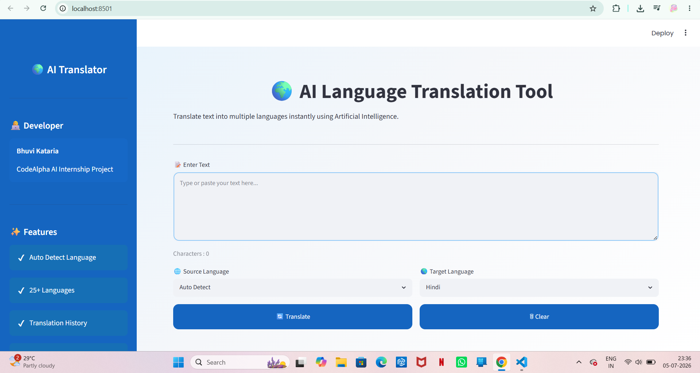
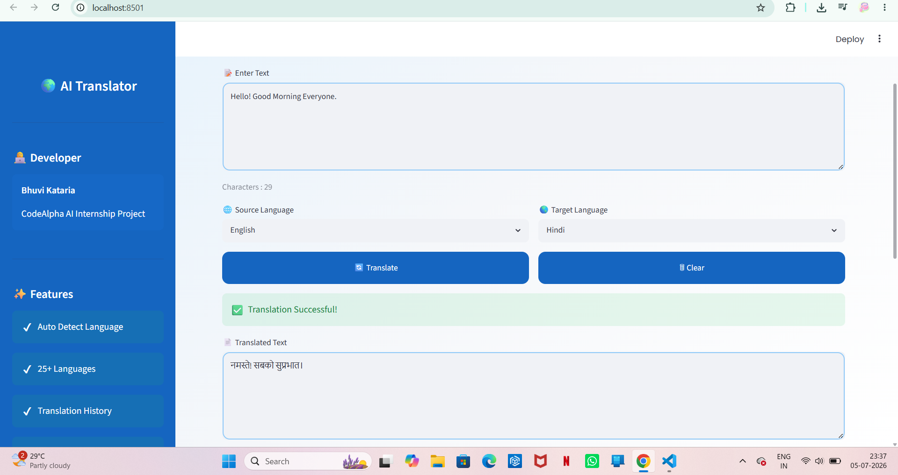
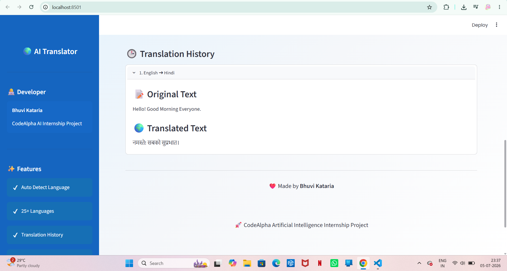
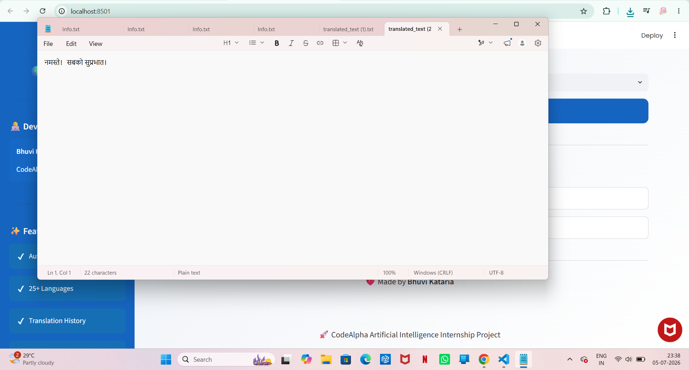

# 🌍 AI Language Translation Tool

A professional Language Translation Tool developed using **Python**, **Streamlit**, and **Deep Translator** as part of the **CodeAlpha Artificial Intelligence Internship**.

## 📌 Features

- 🌐 Translate text into 25+ languages
- 🤖 Auto Detect Source Language
- 📝 Character Counter
- 📥 Download Translated Text
- 🕒 Translation History
- 🗑 Clear Translation History
- 🎨 Beautiful User Interface
- ⚠ Error Handling

## 🛠 Technologies Used

- Python
- Streamlit
- Deep Translator

## 🎯 Objective

The objective of this project is to provide an easy-to-use AI-powered language translation application that enables users to translate text between multiple languages through a clean and interactive interface.

## 📂 Project Structure

CodeAlpha_LanguageTranslation/
│── app.py
│── style.css
│── requirements.txt
│── README.md
│
├── screenshots/
│   ├── home.png
│   ├── translation.png
│   ├── history.png
│   └── download.png

## ▶ How to Run

### 1. Clone the repository

```bash
git clone <your-github-repository-link>
```

### 2. Move into the project folder

```bash
cd CodeAlpha_LanguageTranslation
```

### 3. Install dependencies

```bash
pip install -r requirements.txt
```

### 4. Run the application

```bash
streamlit run app.py
```

## 📸 Screenshots

### Home Page



### Translation



### Translation History



### Download Feature



## 🚀 Future Improvements

- Voice Input Translation
- Text-to-Speech Output
- Support for More Languages
- Save Translation History to File
- Dark Mode

## 👩‍💻 Developer

**Bhuvi Kataria**

CodeAlpha Artificial Intelligence Internship

## 📄 License

This project is created for educational purposes as part of the CodeAlpha Artificial Intelligence Internship.